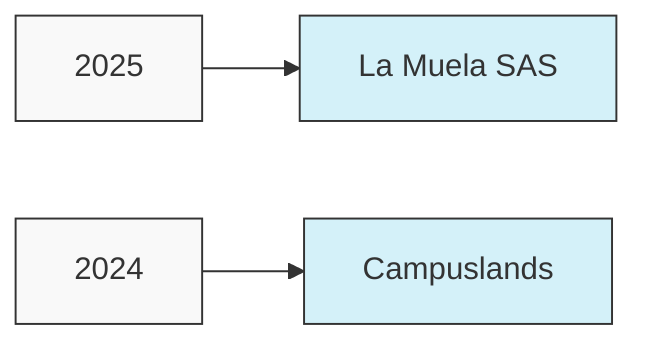

# Daniel Esteban Chacón Díaz | Desarrollador Full Stack 👨‍💻

  
  
  
  
  

## 👋 Sobre mí

Soy un desarrollador de software Full Stack con especialización en Backend. Mi pasión por la tecnología y mi enfoque hacia la resolución de problemas complejos me han permitido destacar en el desarrollo de soluciones robustas y escalables. Cuento con experiencia sólida en múltiples lenguajes de programación y frameworks, lo que me permite adaptarme rápidamente a nuevos entornos tecnológicos.

## 🛠️ Stack Tecnológico

### Frontend

### Backend

### Bases de Datos

### DevOps & Herramientas

### Business Intelligence

## 📊 Estadísticas

  
  

## 🚀 Proyectos Destacados

<table>
  <tr>
    <td width="50%">
      <h3 align="center">RURAQMAKI</h3>
      

        
        

          
        

        
<strong>Node.js, Express, MongoDB</strong> - Plataforma de gestión desarrollada durante mi tiempo en CAMPUSLANDS, implementando un backend robusto con Express y MongoDB.

      

    </td>
    <td width="50%">
      <h3 align="center">CINE CAMPUS</h3>
      

        
        

          
        

        
<strong>MongoDB, Express, Node.js</strong> - Sistema de gestión para cines con MongoDB avanzado, incluyendo funcionalidades de reservas y gestión de películas.

      

    </td>
  </tr>
  <tr>
    <td width="50%">
      <h3 align="center">LANDING PAGES</h3>
      

        
        

          
        

        
<strong>HTML5, CSS3, JavaScript</strong> - Colección de landing pages modernas y responsivas con diseños atractivos y optimizados para SEO.

      

    </td>
    <td width="50%">
      <h3 align="center">POKEDEX</h3>
      

        
        

          
        

        
<strong>JavaScript, APIs, CSS</strong> - Aplicación web que consume la PokéAPI para mostrar información detallada sobre Pokémon con una interfaz interactiva.

      

    </td>
  </tr>
  <tr>
    <td width="50%" colspan="2">
      <h3 align="center">SPOTIFY CLONE</h3>
      

        
        

          
        

        
<strong>JavaScript, HTML5, CSS3</strong> - Réplica de la interfaz de Spotify con funcionalidades de reproducción de música y gestión de playlists.

      

    </td>
  </tr>
</table>

## 📈 Experiencia Profesional

## 💬 Contacto

Me encuentro siempre en búsqueda de nuevos desafíos y oportunidades para aprender y crecer profesionalmente.

  

  

---

  

